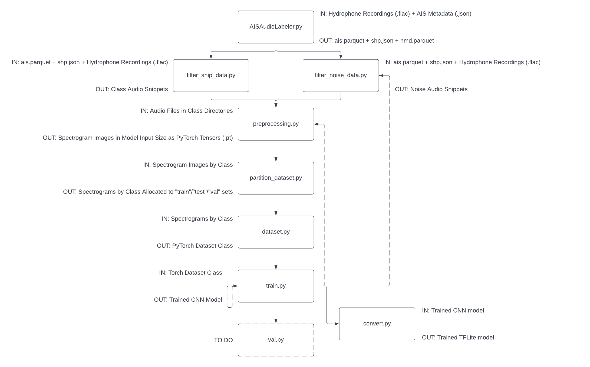

# AI SONOBUOY MODELING PIPELINE

**This pipeline is currently under devlopment**

Currently the AISonobuoy Modeling Pipeline takes data collected by the AISonobuoy and trains a ResNet-18 model binary classifier to discriminate between "Tug" boats and everything else. 

The pipeline can be seen below. 

- `filter_ship_data.py`: Isolates hydrophone audio segments for the class of interest (currently `Tug`) and saves them under a class-label directory 
- `filter_noise_data.py`: Isolates hydrophone audio segments w/ a naive heuristic for filtering out boat noise and saves them under a class-label directory
- `preprocessing.py`: Loads audio segments from the previous step and converts them to an STFT-based spectrogram image PyTorch tensors (of size [3,224,224] which is the ResNet input size) and saves them in class-labelled directories 
- `partition_dataset.py`: Partitions the tensors from the previous step into a `training`, `test`, and `val` sets for training/evaluation and saves as separate set directories w/ class-labelled sub-directories. 
- `dataset.py`: Creates a PyTorch dataset class and creates image-label pairings to be used in training 
- `train.py`: A PyTorch training loop that takes a model (currently ResNet-18) and uses the image-label data pairings to make predictions + learn from them

---

To visualize model training with Tensorboard run: `tensorboard --logdir=<PATH_TO_TENSORBOARD_LOG_DIR>`. The `logdir` by default is `runs`.  