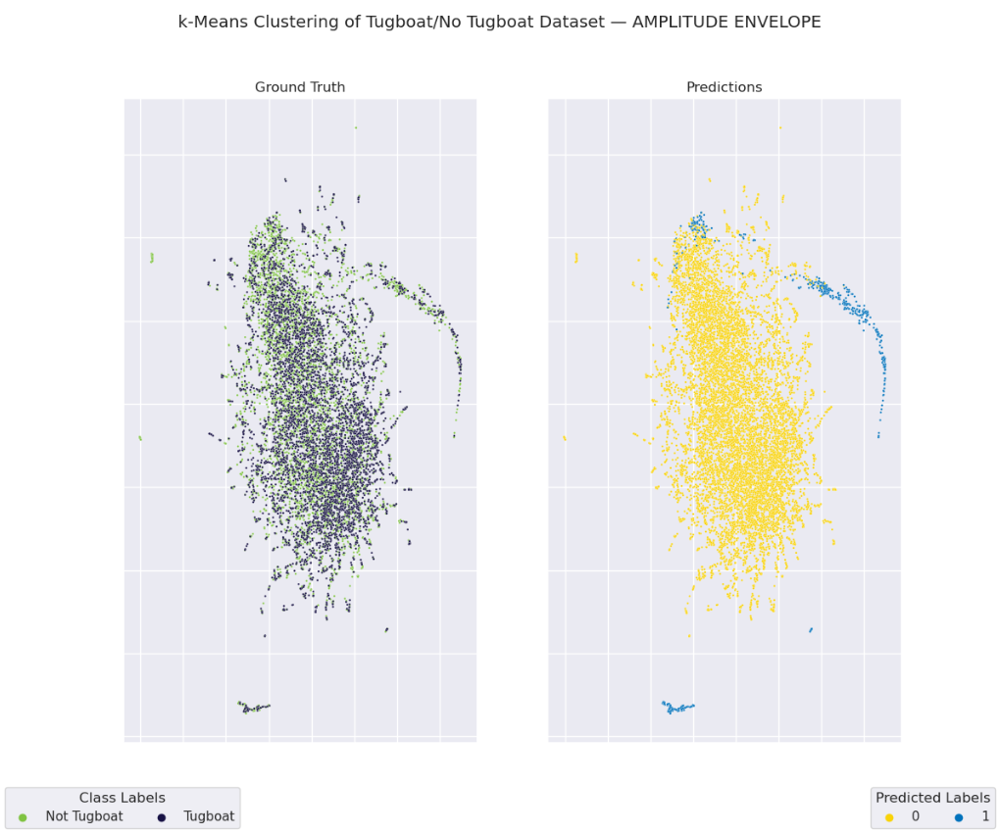
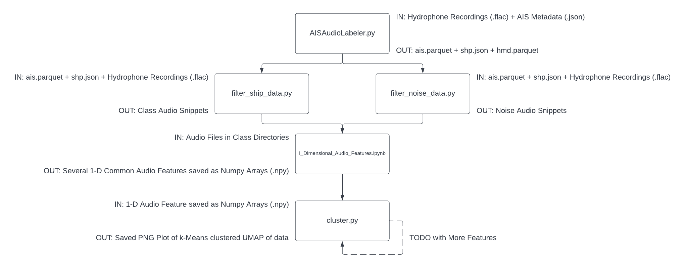

# Clustering + Plotting Pipeline for Hydrophone Audio Data

This pipeline creates 1-Dimensional audio features and then clusters them via k-Means clustering and plots a dimensionality reduced UMAP with ground truth and prediced class labels. An example can be seen below. 



The overall pipeline can be seen below. 



**Note:** This pipeline leverages NVIDIA's `cuML` library as part of their [RAPIDS](https://rapids.ai/index.html) GPU accelerated modeling library, but will still run if you do not have it installed. To run with `cuML`, we reccomend using the Docker option from [here](https://rapids.ai/start.html#get-rapids).

To download (you may have to configure for your enviornment): 

```
docker pull nvcr.io/nvidia/rapidsai/rapidsai-core:22.08-cuda11.5-runtime-ubuntu20.04-py3.8
```

Run the command below from the working directory (`$PWD`) that you want to expose to the docker container where your data is saved (again, you may have to configure for your enviornment).

```
docker run --gpus all --rm -it --shm-size=1g --ulimit memlock=-1 -p 8888:8888 -p 8787:8787 -p 8786:8786 --mount type=bind,source="$(pwd)",target=/rapids/notebooks/host nvcr.io/nvidia/rapidsai/rapidsai-core:22.08-cuda11.5-runtime-ubuntu20.04-py3.8
```

If running on `ssh` in a separate terminal on the host machine you would like to port-forward your `jupyter-lab` session to, run: 

```
ssh -i <PATH_TO_KEYFILE> <HOST_ACCOUNT> -NL 8888:localhost:8888
```