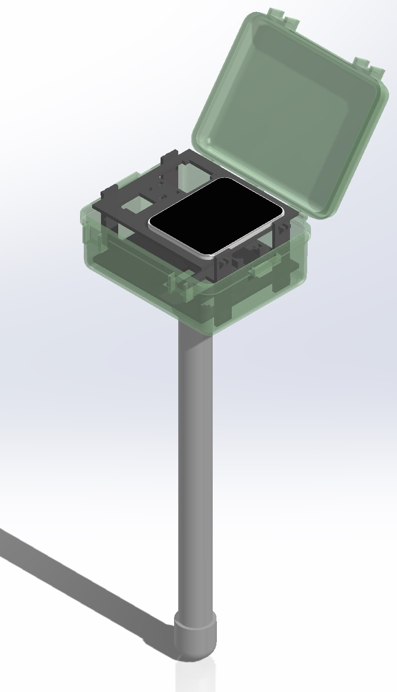
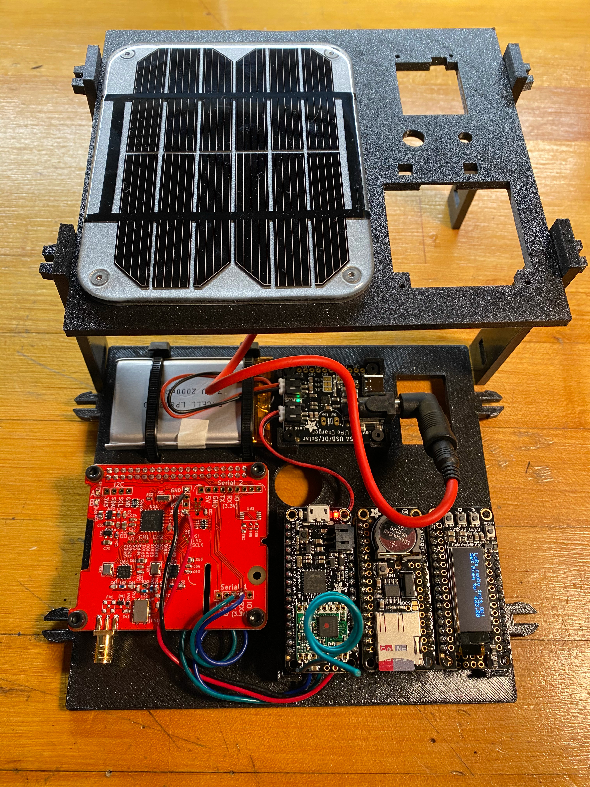
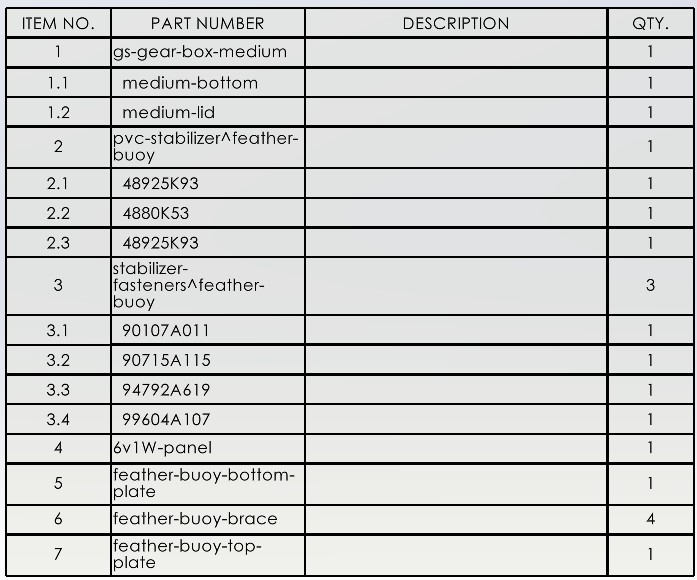

# FeatherBuoy
A buoy designed to support the Adafruit [FeatherWing Tripler](https://www.adafruit.com/product/3417) base board which supports Feather MCU's (Particle, Arduino M0, etc)​ and accessories. Buoy form factor is based on the [MakerBuoy](https://github.com/wjpavalko/Maker-Buoy) design.

# Hardware
## Buoy 3D Models
TODO

## BOM
### Enclosure

### Arduino M0 Feather LoRa + dAISy Receiver
TODO

### Arduino + Hydrophone (Coming Soon)

# Software

## Arduino M0 Feather LoRa + dAISy Receiver
This buoy utilizes the dAISy receiver. When an AIS beacon is received it is logged to the SD card, displayed on the OLED display, and transmitted over the LoRa radio.

The receiver module displays any AIS data that the buoy relays to it on the OLED display.
- [buoy.ino](arduino-m0-lora/buoy.ino)
- [receiver.ino](arduino-m0-lora/receiver.ino)

## Arduino + Hydrophone (Coming soon)