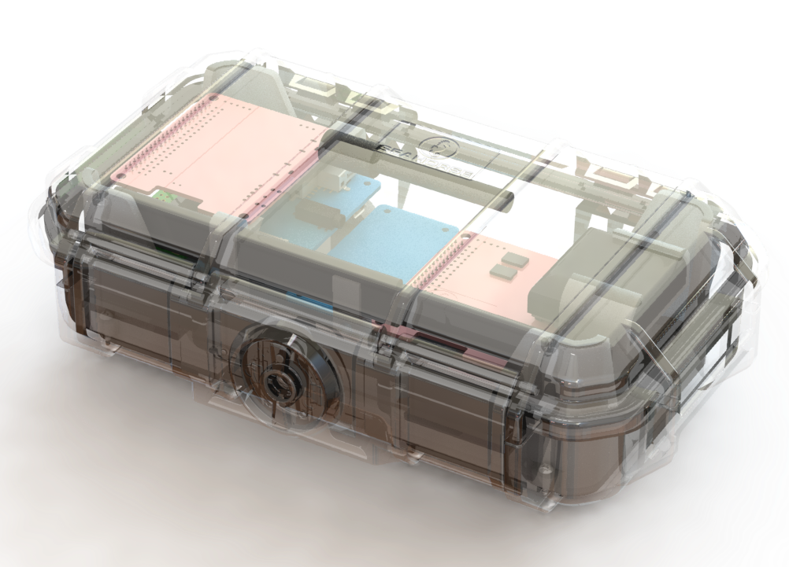
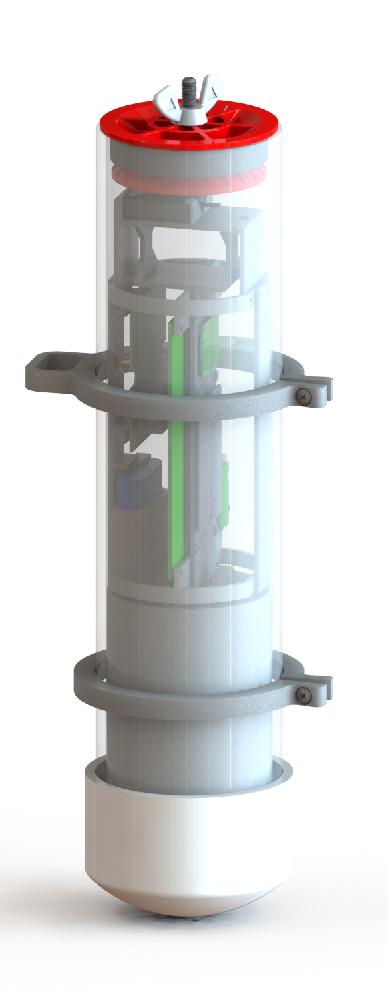

# AISonobuoy

Maritime Situational Awareness: An Exploration

# About

The AI Sonobuoy project is intended to demonstrate the process and design methodology for developing an AI-enabled hydrophone. We are building an integrated system that detects ship propellers using hydrophones. Data is collected, stored, and processed locally using onboard microprocessors. Onboard detection algorithms trigger remote alerts when objects of interest are detected.

# The Life Cycle of AI at the Edge Systems

## Sensor to Solution

Our Sensor to Solution methodology for this project involves a Collection system to record hydrophone audio, AIS data, and other environmental telemetry. An Analysis process automatically labels the audio data and trains a machine learning (ML) model. The ML model is then deployed on a low-power Detection device which can trigger remote alerts for detection events.

```
┌──────────────┐    ┌──────────────┐    ┌──────────────┐
│              │    │              │    │              │
│  COLLECTION  ├───►│   ANALYSIS   ├───►│  DETECTION   │
│              │    │              │    │              │
└──────────────┘    └──────────────┘    └──────────────┘
```

Reference implementations for each of the Sensor to Solution functions can be seen below.

## Collection

### PiBuoy

A buoy designed to run an Raspberry Pi with power management that can do continuous collection of hydrophone audio. It is equipped with an AIS reciever and other sensors such as GPS, LTE, temperature and a 9-axis gryoscope.



See [PiBuoy/README.md](PiBuoy/README.md)

## Analysis

TODO
- tagging tools
- EdgeImpulse
- ML considerations

See [DataScience](./DataScience/README.md)

## Detection

### ParticleTrackerBuoy

A buoy built around the [Particle.io Tracker SOM Evaluation Board](https://docs.particle.io/datasheets/asset-tracking/tracker-som-eval-board/). The Tracker Eval board is connected to a [Adafruit Quad 2x2 FeatherWing](https://www.adafruit.com/product/4253) via the i2c port to allow Feather form factor devices and sensors to be connected. An optional [Myriota Module](https://myriota.com/) can be used to enable satellite communications. The electronics are housed in a 4in schedule 40 PVC pipe. Ballast is added to the bottom of the pipe for appropriate floatation orientation. 



See [ParticleTrackerBuoy/README](ParticleTrackerBuoy/README.md)

# Data Visualization

TODO
A key components of any data collection system is visualization.
