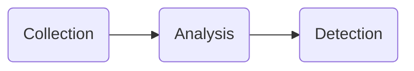
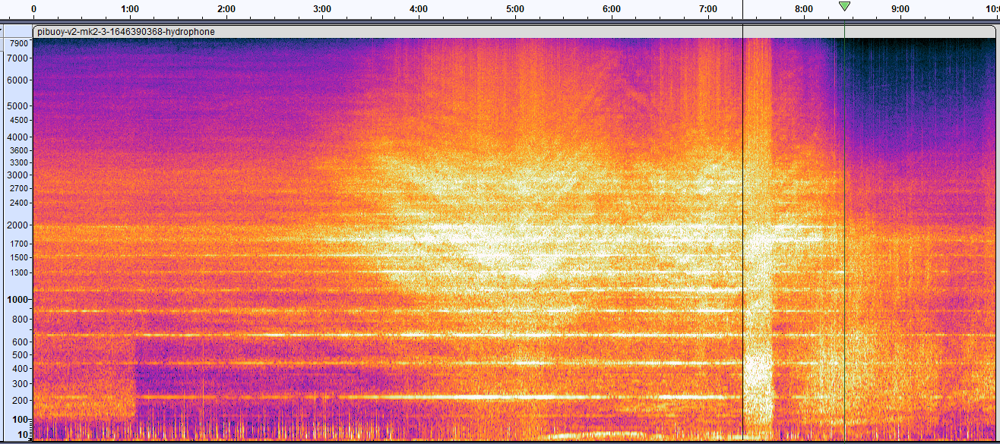
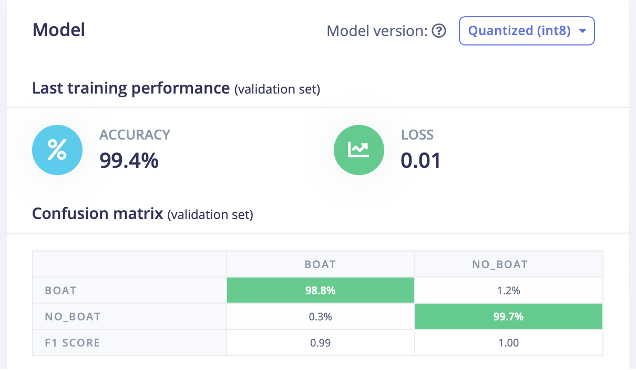
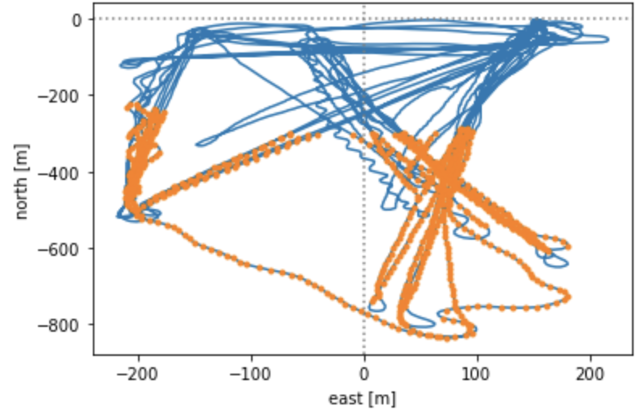
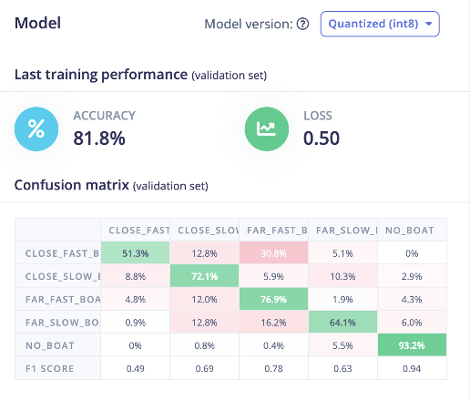

# AISonobuoy

Maritime Situational Awareness: An Exploration

# About

The AI Sonobuoy project is intended to demonstrate the process and design methodology for developing an AI-enabled hydrophone. We are building an integrated system that detects ship propellers using hydrophones. Data is collected, stored, and processed locally using onboard microprocessors. Onboard detection algorithms trigger remote alerts when objects of interest are detected.

# The Life Cycle of AI at the Edge Systems

## Sensor to Solution

Our Sensor to Solution methodology for this project involves a Collection system to record hydrophone audio, AIS data, and other environmental telemetry. An Analysis process automatically labels the audio data and trains a machine learning (ML) model. The ML model is then deployed on a low-power Detection device which can trigger remote alerts for detection events.

Reference implementations for each of the Sensor to Solution functions can be seen below.

## Collection

### PiBuoy

A buoy designed to run an Raspberry Pi with power management that can do continuous collection of hydrophone audio. It is equipped with an AIS receiver and other sensors such as GPS, LTE, temperature, and a 9-axis gyroscope.

See [https://github.com/IQTLabs/aisonobuoy-collector-raspberrypi](https://github.com/IQTLabs/aisonobuoy-collector-raspberrypi)

## Analysis

### Manual Labeling

The simplest method for getting started with analysis is to manually label the audio data.  We use [Audacity](https://www.audacityteam.org) to label segments of boat/no\_boat in our audio files.

### Edge Impulse

With a set of labels in hand, we create a machine learning model using [Edge Impulse](https://www.edgeimpulse.com) that can easily be deployed to the edge.  We use spectrogram features to build a binary classifier for boat/no\_boat:

### Bootstrapping Labels

For more sophisticated models, bootstrapping labels from the data collect is preferable to manual labeling.  We can use GPS tracks or [AIS](https://en.wikipedia.org/wiki/Automatic_identification_system) data to determine vessel speed and distance from the hydrophone.  This allows use to build a 5-class audio classifier with classes: no\_boat, near\_slow, near\_fast, far\_slow, far\_fast. Below we show the far\_slow portion of a particular test run.

Below we show the results of a 5-class Edge Impulse model.

See [DataScience](./DataScience/README.md) for further details.

## Detection

### ParticleTrackerBuoy

A buoy built around the [Particle.io Tracker SOM Evaluation Board](https://docs.particle.io/datasheets/asset-tracking/tracker-som-eval-board/). The Tracker Eval board is connected to a [Adafruit Quad 2x2 FeatherWing](https://www.adafruit.com/product/4253) via the i2c port to allow Feather form factor devices and sensors to be connected. An optional [Myriota Module](https://myriota.com/) can be used to enable satellite communications. The electronics are housed in a 4in schedule 40 PVC pipe. Ballast is added to the bottom of the pipe for appropriate floatation orientation. 

See [ParticleTrackerBuoy/README](ParticleTrackerBuoy/README.md)

# Data Visualization

[Dashboards](https://alper.datav.is/assets/publications/dashboards/dashboards-preprint.pdf) and data visualizations are a key component of modern sensor collection systems, providing greater data visibility, transparency, and a common operating picture.

As part of the AI Sonobuoy project, we are developing a series of visualizations (shown below with locations masked) to help users with a wide range of real-time monitoring and operational decision-making tasks.

|Cloud IoT Visualizations|React Dashboard (Telemetry Data)|React Dashboard (Map View)|
|:--:|:--:|:--:|
||||

This visualization prototyping effort is a work-in-process focused on displaying the AI Sonobuoy's location, temperature (°F), humidity, and state of charge. However, future extensions might visualize different types of data and/or adopt different data encoding strategies. For more details, please see the `aisonobouy-react-dashboards` repository (currently internal-only).
